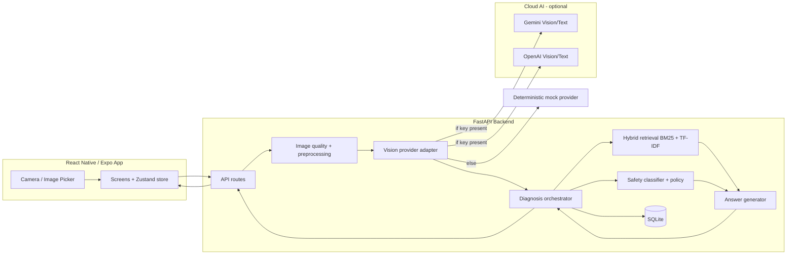
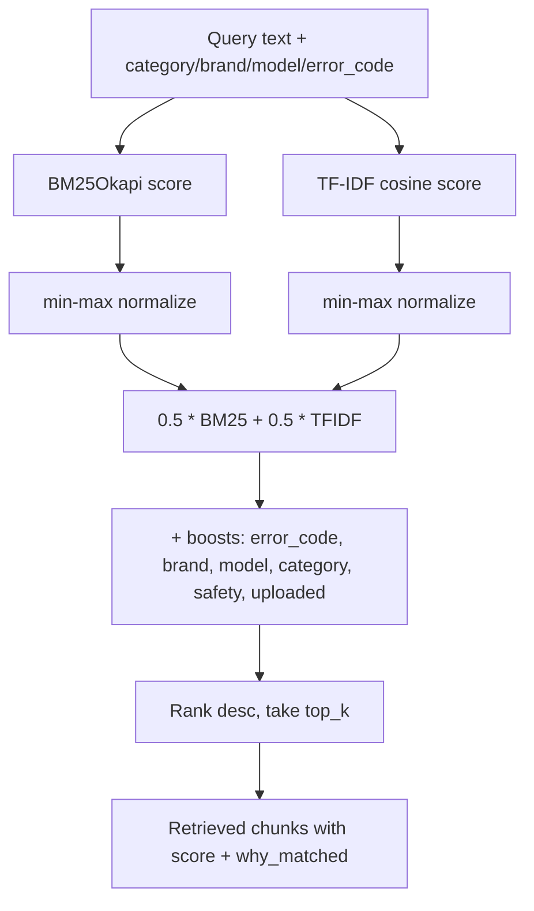
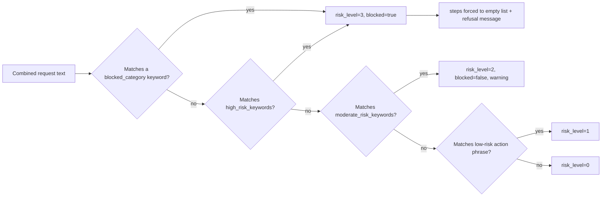

# Architecture

## System overview

## Frontend architecture (`mobile/`)

- **Navigation**: a single native-stack navigator (`src/navigation/RootNavigator.tsx`)
  with 9 screens (Home/Camera, Image Preview, Analyze Progress, Diagnosis, Guided Repair,
  Sources, History, Manual Input, Settings).
- **State**: a single Zustand store (`src/state/repairSessionStore.ts`) holds the
  captured image, in-flight analyze/diagnose results, current guided-repair step index,
  and loading/error flags. There is no Redux/Context boilerplate — one store is enough
  for this app's scope.
- **Services**: `src/services/apiClient.ts` is the only place that talks to the backend
  (fetch + FormData for image upload, JSON for the rest), `src/services/storage.ts` wraps
  AsyncStorage for local settings (API URL override, privacy/demo mode).
- **Theme**: `src/theme/{colors,spacing,typography,shadows}.ts` centralizes the dark,
  glass-morphism design language so screens/components stay visually consistent without
  per-screen ad-hoc styling.
- **No API keys ever ship in the app** — the mobile bundle only knows the backend's base
  URL (`EXPO_PUBLIC_API_BASE_URL`), which is not a secret.

## Backend services (`backend/app/`)

| Module | Responsibility |
|---|---|
| `api/` | FastAPI routers — one file per resource (analyze, diagnose, manuals, sessions, feedback, metrics) |
| `image/` | Blur/brightness/size quality checks (Pillow + OpenCV), preprocessing, demo-image recognition |
| `vision/` | Provider-agnostic vision interface + Gemini/OpenAI/mock adapters |
| `diagnosis/` | Device/error-code/problem classification + the end-to-end orchestrator |
| `manuals/` | Markdown manual parsing, chunking, in-memory hybrid index |
| `rag/` | BM25, TF-IDF, hybrid fusion + boosts, citation validator |
| `safety/` | YAML-driven rule-based risk classifier + policy decisions |
| `generation/` | System prompt, cloud LLM calls, deterministic rule-based fallback generator, JSON schema validation |
| `db/` | SQLAlchemy models + repository functions over SQLite |
| `metrics/` | Latency timing + event logging |
| `evals/` | Retrieval/safety/OCR/citation metrics + report generation |

## AI pipeline (per diagnosis request)

1. **Image quality check** (`image/quality.py`) — Laplacian-variance blur score,
   brightness, minimum resolution. Unusable images short-circuit with a retake request;
   no vision/LLM call is made.
2. **Vision/OCR extraction** (`vision/extractor.py`) — picks the first configured
   provider from `PROVIDER_PRIORITY` (`gemini,openai,mock` by default), falling back to
   the deterministic mock provider on any failure or missing key.
3. **Normalization** (`diagnosis/error_code_parser.py`, `device_identifier.py`) — brand
   aliasing, model pattern matching, error-code regex (`E24`, `OE`, etc.), LED/symptom
   phrase detection.
4. **Device/problem classification** (`diagnosis/problem_classifier.py`) — category +
   problem type + confidence; low confidence triggers a clarifying question instead of a
   guess.
5. **Retrieval** (`rag/hybrid.py`) — BM25 keyword score + TF-IDF cosine score, min-max
   normalized and fused, with additive boosts for exact error-code match, brand/model
   match, category match, safety-relevance, and uploaded-manual priority.
6. **Safety classification** (`safety/classifier.py` + `policy.py`) — independent of
   generation; produces a risk level (0-3), warnings, and a `blocked` flag before any
   step text is generated.
7. **Answer generation** (`generation/answer_generator.py`) — calls a cloud LLM if
   configured, otherwise the deterministic generator builds steps directly from the
   retrieved chunks (reordered into natural document order for a coherent guided-repair
   sequence). If `safety.blocked`, `steps` is forced to `[]` regardless of what a cloud
   LLM produced.
8. **Citation validation** (`rag/citation_validator.py`) — drops any step whose
   `citation_ids` are empty or reference a chunk that wasn't actually retrieved; computes
   citation coverage.
9. **Persistence** (`db/repository.py`) — session, captured image, OCR result, retrieval
   result, generated answer, and latency/coverage metrics are all written to SQLite.

## Retrieval flow

## Safety gate

## Data model (SQLite, `backend/app/db/models.py`)

`repair_sessions` (device/problem/safety/latency summary) 1—N `captured_images`,
`ocr_results`, `retrieval_results`, `generated_answers`, `feedback_events`; plus a
standalone `manual_chunks` table (the retrieval corpus) and `metrics_events` (per-request
telemetry for `/api/metrics`).

## API contract

See [docs/api_contract.md](docs/api_contract.md) for full request/response shapes of
every endpoint (`/health`, `/api/analyze/image`, `/api/diagnose`, `/api/manuals/upload`,
`/api/sessions`, `/api/feedback`, `/api/metrics`, `/api/evals/run`).

## Failure handling

- **Bad image** → quality check fails before any AI call; API returns `usable: false`
  with specific issues; UI shows a retake prompt (no hallucinated diagnosis).
- **Cloud provider error/timeout** → `vision/extractor.py` and
  `generation/answer_generator.py` catch exceptions per-provider and fall through to the
  next configured provider, ultimately to the deterministic mock path — the user never
  sees a raw provider error.
- **Malformed LLM JSON** → `generation/schema_validator.py` validates against the
  Pydantic `GeneratedAnswer` schema; on failure the deterministic generator is used
  instead of surfacing invalid data.
- **Uncited/invalid steps** → dropped by `citation_validator.py` regardless of source.
- **Mobile network/timeout errors** → `apiClient.ts` wraps all calls in a typed
  `ApiError` with a user-facing message; screens render `ErrorState`/`EmptyState`
  components, never a stack trace.

## Scaling plan (beyond this MVP)

- Move manual chunks + retrieval index from in-process SQLite/BM25 to a managed vector
  store (Qdrant/pgvector) once corpus size exceeds what an in-memory TF-IDF matrix can
  comfortably hold.
- Move SQLite to Postgres for multi-instance deployments (the repository layer already
  isolates all SQL behind `db/repository.py`, so this is a connection-string change plus
  a migration tool, not a rewrite).
- Add a queue (e.g. Redis/RQ or Celery) in front of cloud vision/LLM calls if request
  volume requires backpressure/retries beyond `tenacity`'s in-process retry.
- Add response caching for repeated error-code/brand/model combinations.

## Production deployment plan

- Backend: containerize the FastAPI app (Uvicorn/Gunicorn workers), deploy behind a
  managed load balancer (Fly.io/Render/ECS all work fine for this footprint); store
  `GEMINI_API_KEY`/`OPENAI_API_KEY` as platform secrets, never in the image.
- Mobile: build with EAS Build for iOS/Android store distribution; `EXPO_PUBLIC_API_BASE_URL`
  set per-environment (dev/staging/prod) via EAS build profiles.
- Observability: `metrics/event_logger.py` already writes structured events to SQLite;
  in production, ship these to a real metrics backend (e.g. Prometheus/Grafana) instead.
