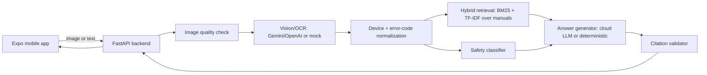

# FixIt Lens

**Camera-guided AI repair assistant.** Scan a device label, error code, warning light, or
broken part; FixIt Lens identifies the device and problem, retrieves trusted manual
excerpts, runs a safety gate, and returns cited, step-by-step troubleshooting — or
refuses and points you to a professional when the repair is genuinely dangerous.

> Screenshots/demo video: see [docs/demo_script.md](docs/demo_script.md) for a scripted
> walkthrough you can record from the running app (no keys required).

## Why this isn't a generic chatbot

FixIt Lens enforces one rule in code, not just in a prompt:
**no citation + no safety classification = no repair instruction.** Every procedural step
must cite a real, retrieved manual chunk (`backend/app/rag/citation_validator.py`), and
every request runs through a rule-based safety classifier *before* generation
(`backend/app/safety/`) — a blocked category zeroes out `steps` regardless of what a
cloud LLM tried to produce. See [SAFETY.md](SAFETY.md) for the full model.

## Features

- Camera-first mobile UI (Expo/React Native) with an animated scan overlay, glass-card
  premium dark theme, confidence chips, safety badges, and a step-by-step guided repair
  flow with Done/Didn't work/Skip/Stop feedback.
- FastAPI backend: image quality checks, cloud vision/OCR extraction, device/error-code
  normalization, hybrid BM25+TF-IDF retrieval over manuals, rule-based safety gate, and
  structured JSON answer generation.
- Works with **zero API keys** out of the box via a deterministic mock provider — flip on
  real Gemini/OpenAI vision+text by adding keys to `backend/.env`.
- A real, from-scratch evaluation suite (32 retrieval cases, 27 safety cases, 6 OCR
  cases) with a regenerated `backend/reports/eval_report.md` on every run.
- Manual upload flow: paste/upload your own manual text and it becomes an immediately
  searchable, priority-ranked source.

## Architecture

See [ARCHITECTURE.md](ARCHITECTURE.md) for full diagrams (system, retrieval flow, safety
gate, data model) and the failure-handling/scaling/deployment plan. High level:



## User flows

Flow A (camera diagnosis), Flow B (type error code), Flow C (manual upload), Flow D
(dangerous refusal), Flow E (bad image) — see [docs/product_spec.md](docs/product_spec.md)
for details and [docs/demo_script.md](docs/demo_script.md) for a click-through script.

## Tech stack

**Frontend**: React Native, Expo (SDK 57), TypeScript, expo-camera, expo-image-picker,
React Navigation, Zustand, expo-linear-gradient, expo-blur, expo-haptics.

**Backend**: Python 3.11, FastAPI, Uvicorn, Pydantic/Pydantic Settings, SQLAlchemy +
SQLite, Pillow, OpenCV (headless), scikit-learn (TF-IDF), rank-bm25, HTTPX, Tenacity,
PyYAML, pytest.

No PyTorch, transformers, sentence-transformers, Ollama, llama.cpp, or vLLM — this is a
cloud-API-first project with lightweight local logic, sized to run comfortably on a
MacBook M1.

## Cloud model strategy

A provider-adapter interface (`backend/app/vision/base.py`,
`backend/app/generation/answer_generator.py`) picks the first configured provider from
`PROVIDER_PRIORITY` (default `gemini,openai,mock`):

- **Gemini** (`gemini-1.5-flash` by default) for vision + text, if `GEMINI_API_KEY` is set.
- **OpenAI** (`gpt-4o-mini` by default) for vision + text, if `OPENAI_API_KEY` is set.
- **Mock** — deterministic, offline, no network calls — used automatically when no keys
  are present, and as an automatic fallback if a cloud call fails.

API keys live only in `backend/.env` (gitignored) and are never sent to or bundled with
the mobile app.

## AI pipeline

Image quality check → vision/OCR extraction → normalization (brand/model/error-code) →
device/problem classification → hybrid retrieval → safety classification → answer
generation (cloud LLM or deterministic fallback) → citation validation → persistence.
Full detail in [ARCHITECTURE.md](ARCHITECTURE.md#ai-pipeline-per-diagnosis-request).

## Safety system

See [SAFETY.md](SAFETY.md): 4 risk levels (0-3), 12 explicitly blocked high-risk
categories, mandatory citations, and a hard-coded refusal message for anything
requiring a qualified professional.

## RAG / manual retrieval

7 seeded manuals (`backend/data/manuals/*.md`), parsed by heading into 50 chunks, indexed
with both BM25 (`rank-bm25`) and TF-IDF (`scikit-learn`), fused with weighted boosts for
exact error-code, brand/model, category, and safety-relevance matches, plus a priority
boost for user-uploaded manuals. See `backend/app/rag/hybrid.py`.

## Evaluation metrics

Full methodology and latest numbers in [EVALUATION.md](EVALUATION.md). Headline results
from the current mock-mode run (`backend/reports/eval_report.md`):

| Metric | Result |
|---|---|
| Recall@3 / Recall@5 | 96.9% / 100.0% |
| MRR / nDCG@5 | 0.959 / 0.969 |
| Safety high-risk block rate | **100.0%** |
| Safety false negative rate | **0.0%** |
| Citation coverage | **100.0%** |
| OCR/device ID accuracy (demo images) | 100.0% |

## Quickstart

```bash
cd fixit-lens
make setup   # backend venv + deps, mobile npm deps
make seed    # generate demo images, seed manuals, build retrieval index
make test    # backend pytest + mobile typecheck/lint
make eval    # run the evaluation suite, writes backend/reports/eval_report.md
make backend # start FastAPI on http://127.0.0.1:8000
```

In another terminal:

```bash
make mobile  # or: make web
```

> **Note for unusual paths**: if your project path contains a colon (`:`), Python's
> `venv` module refuses to create a virtualenv there. `make setup` detects this
> automatically and creates the venv under `~/.venvs/fixit-lens-backend`, symlinked back
> into `backend/.venv` — no action needed.

## Environment variables

See [.env.example](.env.example) (root reference), [backend/.env.example](backend/.env.example)
(copied to `backend/.env` by `make setup`), and [mobile/.env.example](mobile/.env.example).
Key variables:

```
PROVIDER_PRIORITY=gemini,openai,mock
GEMINI_API_KEY=
OPENAI_API_KEY=
EXPO_PUBLIC_API_BASE_URL=http://127.0.0.1:8000
```

To enable real cloud vision/LLM calls, add a Gemini and/or OpenAI key to `backend/.env`
and restart `make backend` — no code changes needed.

## API examples

Full contract in [docs/api_contract.md](docs/api_contract.md). Quick example:

```bash
curl -X POST http://127.0.0.1:8000/api/analyze/image \
  -F "image=@backend/data/demo_images/tp_link_ax55_red_led.png;type=image/png"

curl -X POST http://127.0.0.1:8000/api/diagnose \
  -H "Content-Type: application/json" \
  -d '{"device_category":"dishwasher","brand":"Bosch","error_code":"E24"}'
```

## Demo scenarios

Six scripted, zero-key demo scenarios (router, dishwasher, washing machine, laptop,
dangerous refusal, bad image) in [docs/demo_script.md](docs/demo_script.md).

## Tests

```bash
make test
```

51 backend pytest cases (health, image quality, error-code parsing, safety classifier,
retriever, citation validator, answer schema, diagnosis orchestrator, analyze/diagnose
API), plus mobile TypeScript typecheck and ESLint — all passing with zero errors.

## Limitations

- Demo-scale manual corpus (7 manuals, 50 chunks) — not a production knowledge base.
- Mock vision provider recognizes demo images by filename, not real OCR; real-photo
  accuracy requires enabling a cloud vision provider.
- BM25/TF-IDF retrieval has no semantic embedding model (see
  [EVALUATION.md](EVALUATION.md#known-weaknesses)).
- Not a certified diagnostic tool or a replacement for a qualified technician.

## Privacy & safety

See [SAFETY.md](SAFETY.md#privacy-notes). API keys never leave `backend/.env`; images are
processed in memory and not persisted; a Settings-screen action clears local device data.

## Production roadmap

See [ARCHITECTURE.md](ARCHITECTURE.md#scaling-plan-beyond-this-mvp) and
[ARCHITECTURE.md](ARCHITECTURE.md#production-deployment-plan) for the path to a managed
vector store, Postgres, containerized deployment, and EAS-built mobile releases.

## Resume bullets

- Built FixIt Lens, a React Native + FastAPI multimodal repair assistant using cloud
  vision APIs, device/error-code extraction, and hybrid RAG over manuals to generate
  cited, safety-checked troubleshooting steps.
- Implemented retrieval over 50 manual chunks with BM25/TF-IDF hybrid search, achieving
  Recall@3 of 96.9% (Recall@5 of 100%) across 32 device and error-code queries.
- Designed a repair-safety guardrail system that blocks 12 categories of high-voltage/
  gas/electrical procedures with a 100% high-risk block rate and 0% false negatives
  across 27 test cases, validates 100% citation coverage for procedural steps, and logs
  latency, confidence, provider usage, and feedback for every diagnosis.

## Interview talking points

- Why the citation validator runs as a hard code-level gate (not a prompt instruction),
  and how it behaves identically whether the answer came from Gemini, OpenAI, or the
  deterministic fallback.
- Why safety classification happens *before* and *independent of* generation, so a
  jailbroken or hallucinating LLM still can't produce steps for a blocked category.
- The hybrid BM25+TF-IDF fusion with metadata boosts, and the retrieval-vs-presentation
  ordering trick (rank by relevance, then re-sort the selected set into natural document
  order so guided-repair steps read coherently).
- The provider-adapter pattern that lets the whole app run fully offline/deterministic
  for tests and demos, with zero code changes needed to switch on real cloud AI.

## Known limitations of this build

External API keys were not configured during this build, so the app runs end-to-end in
**local/mock mode** — every metric and demo scenario above was verified against the
deterministic mock provider. Add `GEMINI_API_KEY` and/or `OPENAI_API_KEY` to
`backend/.env` to exercise the real cloud vision/LLM code paths.
