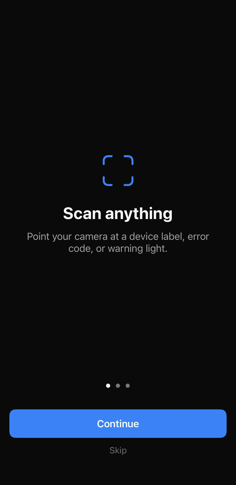
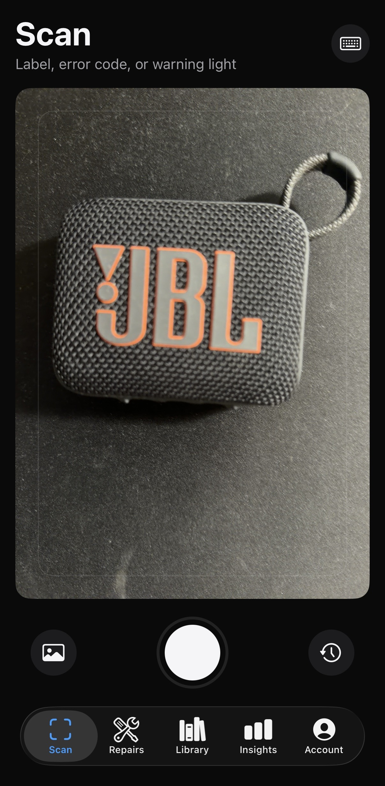
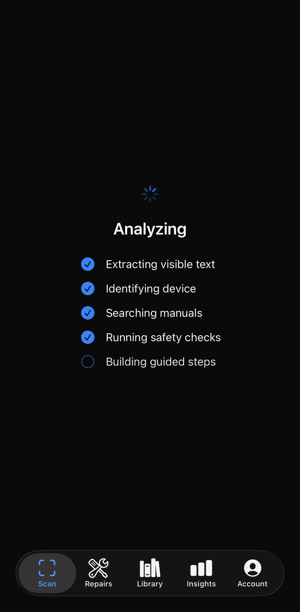
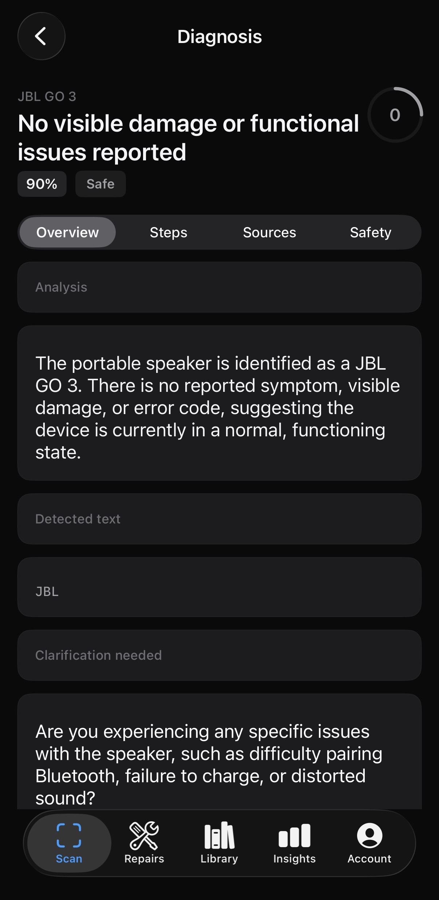
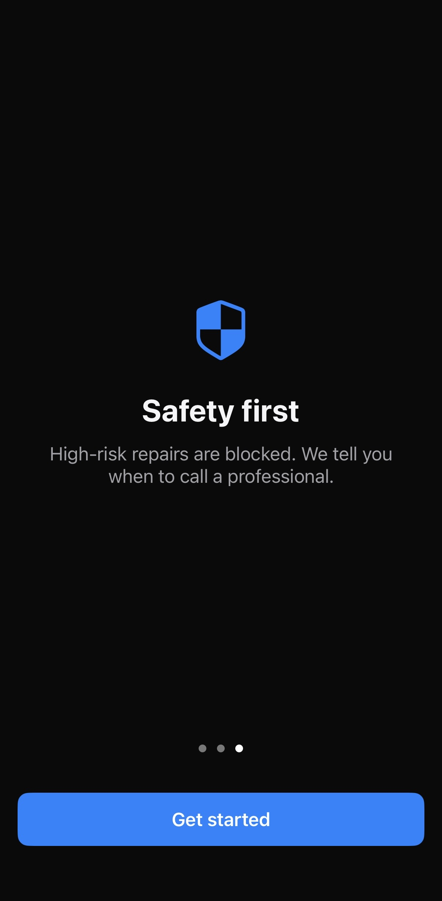
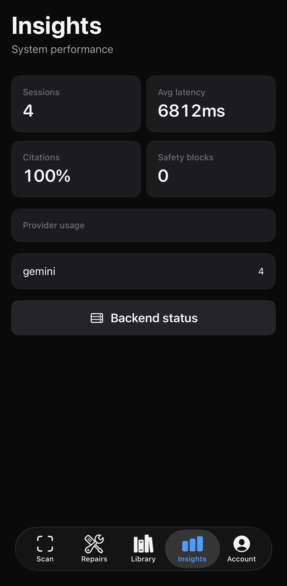
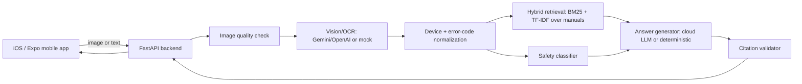

# FixIt Lens

**Camera-guided AI repair assistant.** Point your phone at a device label, error code, warning light, or broken part — FixIt Lens identifies what it sees, pulls relevant manual excerpts, runs a safety gate, and returns cited troubleshooting steps. High-risk repairs are blocked with a clear “call a professional” message.

## Screenshots

Native iOS app running against a live backend with Gemini vision + text:

| Onboarding | Camera scan | Analysis pipeline |
|:---:|:---:|:---:|
|  |  |  |

| Diagnosis result | Safety onboarding | Insights (Gemini provider) |
|:---:|:---:|:---:|
|  |  |  |

## Why this isn't a generic chatbot

FixIt Lens enforces one rule in code, not just in a prompt:
**no citation + no safety classification = no repair instruction.** Every procedural step must cite a real, retrieved manual chunk (`backend/app/rag/citation_validator.py`), and every request runs through a rule-based safety classifier *before* generation (`backend/app/safety/`) — a blocked category zeroes out `steps` regardless of what a cloud LLM tried to produce. See [SAFETY.md](SAFETY.md) for the full model.

## Features

- **Native iOS app** (SwiftUI) — camera capture, image crop/resize before analyze, editable backend URL, repair history, guided steps, and insights dashboard. See [docs/native_ios.md](docs/native_ios.md).
- **Expo/React Native app** — animated scan overlay, glass-card dark theme, confidence chips, safety badges, and step-by-step guided repair flow with Done/Didn't work/Skip/Stop feedback.
- **FastAPI backend** — image quality checks, cloud vision/OCR extraction, device/error-code normalization, hybrid BM25+TF-IDF retrieval over manuals, rule-based safety gate, and structured JSON answer generation.
- **Gemini Interactions API** (`gemini-3.5-flash`) for vision + text when `GEMINI_API_KEY` is set; OpenAI and a deterministic mock provider as fallbacks.
- **Works with zero API keys** via the mock provider for offline demos and tests.
- Evaluation suite (32 retrieval, 27 safety, 6 OCR cases) with `backend/reports/eval_report.md` regenerated on every run.
- Manual upload flow: paste or upload your own manual text and it becomes an immediately searchable source.

## Architecture

See [ARCHITECTURE.md](ARCHITECTURE.md) for full diagrams. High level:



## Tech stack

**iOS (native)**: SwiftUI, AVFoundation camera, URLSession API client.

**Mobile (Expo)**: React Native, Expo SDK 57, TypeScript, expo-camera, React Navigation, Zustand.

**Backend**: Python 3.11, FastAPI, Uvicorn, Pydantic Settings, SQLAlchemy + SQLite, Pillow, OpenCV (headless), scikit-learn, rank-bm25, HTTPX, Tenacity, pytest.

No PyTorch or local LLM runtimes — cloud-API-first with lightweight local logic, sized to run on a MacBook M1.

## Cloud model strategy

Provider adapters (`backend/app/vision/`, `backend/app/generation/answer_generator.py`) try providers in `PROVIDER_PRIORITY` order (default `gemini,openai,mock`):

| Provider | Default model | When used |
|---|---|---|
| **Gemini** | `gemini-3.5-flash` | `GEMINI_API_KEY` set — uses the [Interactions API](https://ai.google.dev/gemini-api/docs/get-started) with `x-goog-api-key` header auth |
| **OpenAI** | `gpt-4o-mini` | `OPENAI_API_KEY` set |
| **Mock** | — | No keys configured, or cloud call fails |

API keys live only in `backend/.env` (gitignored) and are never bundled with the mobile app.

## Quickstart

```bash
cd fixit-lens
make setup   # backend venv + deps, mobile npm deps
make seed    # demo images, seed manuals, build retrieval index
make test    # backend pytest + mobile typecheck/lint
make backend # start FastAPI on http://127.0.0.1:8000
```

### Native iOS (recommended on a physical iPhone)

```bash
make backend-lan          # backend on 0.0.0.0:8000 for same Wi‑Fi
make ios-native-open      # opens FixItLens.xcodeproj in Xcode → Run
```

In the app: **Account → Backend status → Edit URL** and enter `http://<your-mac-lan-ip>:8000`.

Full guide: [docs/native_ios.md](docs/native_ios.md)

### Expo mobile

```bash
make mobile   # or: make web / make ios
```

Physical iPhone via Expo: [docs/ios_build.md](docs/ios_build.md)

> **Paths with colons** (`AI:ML/...`): `make setup` creates the Python venv under `~/.venvs/fixit-lens-backend` and symlinks it — no action needed.

## Environment variables

Copy `backend/.env.example` → `backend/.env` (done automatically by `make setup`):

```
PROVIDER_PRIORITY=gemini,openai,mock
GEMINI_API_KEY=          # from https://aistudio.google.com/apikey
GEMINI_VISION_MODEL=gemini-3.5-flash
GEMINI_TEXT_MODEL=gemini-3.5-flash
OPENAI_API_KEY=
EXPO_PUBLIC_API_BASE_URL=http://127.0.0.1:8000
```

Restart `make backend` after adding keys.

## API examples

```bash
curl -X POST http://127.0.0.1:8000/api/analyze/image \
  -F "image=@backend/data/demo_images/tp_link_ax55_red_led.png;type=image/png"

curl -X POST http://127.0.0.1:8000/api/diagnose \
  -H "Content-Type: application/json" \
  -d '{"device_category":"dishwasher","brand":"Bosch","error_code":"E24"}'
```

Full contract: [docs/api_contract.md](docs/api_contract.md)

## Evaluation metrics

See [EVALUATION.md](EVALUATION.md). Headline mock-mode results (`backend/reports/eval_report.md`):

| Metric | Result |
|---|---|
| Recall@3 / Recall@5 | 96.9% / 100.0% |
| Safety high-risk block rate | **100.0%** |
| Citation coverage | **100.0%** |

## Tests

```bash
make test
```

Backend pytest (health, safety, retrieval, citation, diagnosis, analyze API) plus mobile TypeScript typecheck and ESLint.

## Safety

See [SAFETY.md](SAFETY.md): 4 risk levels, 12 blocked high-risk categories, mandatory citations, and hard refusal for work requiring a qualified professional.

## Limitations

- Demo-scale manual corpus (7 manuals, 50 chunks) — not a production knowledge base.
- BM25/TF-IDF retrieval has no semantic embedding model.
- Not a certified diagnostic tool or a replacement for a qualified technician.

## Privacy

API keys never leave `backend/.env`. Images are processed in memory. **Account → Clear all history** deletes sessions on the server and locally.

## Docs

| Doc | Contents |
|---|---|
| [ARCHITECTURE.md](ARCHITECTURE.md) | System design, RAG flow, scaling plan |
| [SAFETY.md](SAFETY.md) | Risk model and blocked categories |
| [EVALUATION.md](EVALUATION.md) | Eval methodology and metrics |
| [docs/native_ios.md](docs/native_ios.md) | SwiftUI app setup on a real iPhone |
| [docs/ios_build.md](docs/ios_build.md) | Expo on physical iPhone |
| [docs/demo_script.md](docs/demo_script.md) | Scripted demo walkthrough |

## License

MIT — see repository for details.
