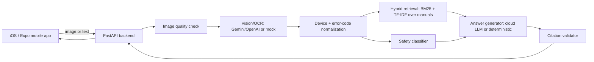

# FixIt Lens

**Multimodal AI repair assistant — camera in, cited diagnosis out.**

Point your phone at a device label, error code, warning light, or broken part. FixIt Lens
runs a full vision → retrieval → safety → generation pipeline: it identifies what you're
looking at, pulls the right manual excerpts, classifies repair risk, and returns
step-by-step troubleshooting with mandatory source citations — or refuses and routes you
to a professional when the repair is genuinely dangerous.

This is not a chat wrapper. It is a **multi-stage diagnosis system** with hard-coded
guardrails, hybrid RAG, provider failover, and two production mobile clients (native
SwiftUI + Expo) backed by a typed FastAPI orchestration layer.

## Screenshots

Native iOS app on a physical iPhone, live backend, Gemini vision + text:

| Onboarding | Camera scan | Analysis pipeline |
|:---:|:---:|:---:|
|  |  |  |

| Diagnosis result | Safety onboarding | Insights (Gemini provider) |
|:---:|:---:|:---:|
|  |  |  |

> Record your own walkthrough: [docs/demo_script.md](docs/demo_script.md) — six scripted scenarios, works with or without API keys.

## Why this isn't a generic chatbot

Most "AI repair" demos are a single LLM call with a system prompt. FixIt Lens enforces a
different contract in **code**, not prose:

**no citation + no safety classification = no repair instruction.**

Every procedural step must cite a real, retrieved manual chunk
(`backend/app/rag/citation_validator.py`). Every request runs through a rule-based safety
classifier *before* generation (`backend/app/safety/`) — a blocked category zeroes out
`steps` regardless of what Gemini, OpenAI, or any model tried to produce. A jailbroken or
hallucinating LLM still cannot emit steps for a blocked high-voltage, gas, or electrical
category.

See [SAFETY.md](SAFETY.md) for the full risk model.

## What makes this hard

Building a repair assistant that is *safe to show someone* requires solving problems a
plain chatbot never touches:

| Challenge | How FixIt Lens handles it |
|---|---|
| **Multimodal understanding** | Cloud vision extracts OCR, device category, brand/model, error codes, and symptoms from arbitrary photos — with provider failover (Gemini → OpenAI → deterministic mock). |
| **Grounded answers** | Hybrid BM25 + TF-IDF retrieval over a manual corpus; answers must cite retrieved chunks or the pipeline rejects them. |
| **Safety before generation** | 12 blocked high-risk categories, 4 risk levels, hard refusal paths — classification runs independently of the LLM. |
| **Structured output under constraints** | JSON-schema vision extraction, citation validation, step ordering, confidence scoring, and session persistence across the full diagnose flow. |
| **Real mobile UX** | Native SwiftUI app with AVFoundation camera, pre-analyze crop/resize, guided repair with step feedback, repair history, and a live insights dashboard. |
| **Measurable quality** | From-scratch eval suite: 32 retrieval cases, 27 safety cases, 6 OCR cases — metrics regenerated on every `make eval` run. |

## Features

- **Native iOS app (SwiftUI)** — camera capture, image crop/resize before analyze,
  editable backend URL for LAN dev, repair history with server-side clear, guided steps
  with Done/Didn't work/Skip/Stop feedback, and provider/latency insights. See
  [docs/native_ios.md](docs/native_ios.md).
- **Expo/React Native app** — animated scan overlay, glass-card premium dark theme,
  confidence chips, safety badges, and the same end-to-end diagnose flow. See
  [docs/ios_build.md](docs/ios_build.md).
- **FastAPI diagnosis backend** — image quality gating, cloud vision/OCR extraction,
  device/error-code normalization, hybrid retrieval, rule-based safety gate, structured
  JSON answer generation, session APIs, and feedback/metrics logging.
- **Gemini Interactions API** (`gemini-3.5-flash`) for vision + text via Google's
  current [Interactions API](https://ai.google.dev/gemini-api/docs/get-started); OpenAI
  (`gpt-4o-mini`) and a deterministic mock provider as automatic fallbacks.
- **Zero-key offline mode** — full end-to-end demos and CI with the mock provider; flip on
  real cloud AI by adding keys to `backend/.env`, no code changes.
- **Manual upload flow** — paste or upload your own manual text; it is chunked, indexed,
  and priority-ranked immediately.
- **Six scripted demo scenarios** — router, dishwasher, washing machine, laptop, dangerous
  refusal, bad image. See [docs/demo_script.md](docs/demo_script.md).

## User flows

| Flow | Description |
|---|---|
| **A — Camera diagnosis** | Capture → quality check → vision extract → retrieve → safety → generate → cite → guided repair |
| **B — Type error code** | Manual text input bypasses camera; same backend pipeline |
| **C — Manual upload** | User manual becomes a searchable, boosted retrieval source |
| **D — Dangerous refusal** | Safety gate blocks procedural steps; shows professional referral |
| **E — Bad image** | Quality check warns or rejects; user can retake or proceed with warnings |

Full spec: [docs/product_spec.md](docs/product_spec.md)

## Architecture

See [ARCHITECTURE.md](ARCHITECTURE.md) for system diagrams (retrieval flow, safety gate,
data model), failure handling, scaling, and deployment plan.



## AI pipeline

Every diagnosis request walks the same orchestrated path:

```
Image quality check
  → vision/OCR extraction (structured JSON)
  → normalization (brand / model / error-code)
  → device + problem classification
  → hybrid BM25 + TF-IDF retrieval
  → safety classification (pre-generation)
  → answer generation (cloud LLM or deterministic fallback)
  → citation validation (post-generation)
  → persistence + metrics
```

Full detail: [ARCHITECTURE.md#ai-pipeline-per-diagnosis-request](ARCHITECTURE.md#ai-pipeline-per-diagnosis-request)

## RAG / manual retrieval

7 seeded manuals (`backend/data/manuals/*.md`), parsed by heading into **50 chunks**,
indexed with both BM25 (`rank-bm25`) and TF-IDF (`scikit-learn`), fused with weighted
boosts for exact error-code, brand/model, category, and safety-relevance matches, plus a
priority boost for user-uploaded manuals. Selected chunks are re-sorted into natural
document order so guided-repair steps read coherently end-to-end.

Implementation: `backend/app/rag/hybrid.py`

## Cloud model strategy

A provider-adapter interface (`backend/app/vision/base.py`,
`backend/app/generation/answer_generator.py`) picks the first configured provider from
`PROVIDER_PRIORITY` (default `gemini,openai,mock`):

| Provider | Default model | Role |
|---|---|---|
| **Gemini** | `gemini-3.5-flash` | Vision + text via Interactions API (`x-goog-api-key` header auth) |
| **OpenAI** | `gpt-4o-mini` | Vision + text fallback |
| **Mock** | — | Deterministic offline path for tests, demos, and provider failure |

API keys live only in `backend/.env` (gitignored) and are never sent to or bundled with
the mobile app.

## Safety system

See [SAFETY.md](SAFETY.md): **4 risk levels (0–3)**, **12 explicitly blocked high-risk
categories**, mandatory citations, and a hard-coded refusal message for anything requiring
a qualified professional.

## Evaluation metrics

Full methodology: [EVALUATION.md](EVALUATION.md). Latest numbers from
`backend/reports/eval_report.md`:

| Metric | Result |
|---|---|
| Recall@3 / Recall@5 | **96.9% / 100.0%** |
| MRR / nDCG@5 | **0.959 / 0.969** |
| Safety high-risk block rate | **100.0%** |
| Safety false negative rate | **0.0%** |
| Citation coverage | **100.0%** |
| OCR/device ID accuracy (demo images) | **100.0%** |

```bash
make eval   # regenerate backend/reports/eval_report.md
```

## Tech stack

**iOS (native)**: SwiftUI, AVFoundation camera, URLSession API client, programmatic Xcode
project generation.

**Mobile (Expo)**: React Native, Expo SDK 57, TypeScript, expo-camera, expo-image-picker,
React Navigation, Zustand, expo-linear-gradient, expo-blur, expo-haptics.

**Backend**: Python 3.11, FastAPI, Uvicorn, Pydantic Settings, SQLAlchemy + SQLite,
Pillow, OpenCV (headless), scikit-learn (TF-IDF), rank-bm25, HTTPX, Tenacity, PyYAML,
pytest.

Deliberately **no** PyTorch, transformers, sentence-transformers, Ollama, llama.cpp, or
vLLM — a cloud-API-first architecture with lightweight local logic, designed to run
comfortably on a MacBook M1 while keeping inference cost and ops complexity low.

## Quickstart

```bash
cd fixit-lens
make setup   # backend venv + deps, mobile npm deps
make seed    # generate demo images, seed manuals, build retrieval index
make test    # backend pytest + mobile typecheck/lint
make eval    # run evaluation suite → backend/reports/eval_report.md
make demo    # seed + smoke test the full pipeline
make backend # start FastAPI on http://127.0.0.1:8000
```

### Native iOS (recommended on a physical iPhone)

```bash
make backend-lan          # backend on 0.0.0.0:8000 for same Wi‑Fi
make ios-native-open      # opens FixItLens.xcodeproj in Xcode → Run
```

In the app: **Account → Backend status → Edit URL** → `http://<your-mac-lan-ip>:8000`

### Expo mobile

```bash
make mobile   # or: make web / make ios
```

> **Paths with colons** (`AI:ML/...`): `make setup` auto-creates the Python venv under
> `~/.venvs/fixit-lens-backend` and symlinks it — no action needed.

## Environment variables

See [backend/.env.example](backend/.env.example) and [mobile/.env.example](mobile/.env.example)
(copied to `backend/.env` by `make setup`):

```
PROVIDER_PRIORITY=gemini,openai,mock
GEMINI_API_KEY=          # https://aistudio.google.com/apikey
GEMINI_VISION_MODEL=gemini-3.5-flash
GEMINI_TEXT_MODEL=gemini-3.5-flash
OPENAI_API_KEY=
EXPO_PUBLIC_API_BASE_URL=http://127.0.0.1:8000
```

Restart `make backend` after adding keys.

## API examples

Full contract: [docs/api_contract.md](docs/api_contract.md)

```bash
curl -X POST http://127.0.0.1:8000/api/analyze/image \
  -F "image=@backend/data/demo_images/tp_link_ax55_red_led.png;type=image/png"

curl -X POST http://127.0.0.1:8000/api/diagnose \
  -H "Content-Type: application/json" \
  -d '{"device_category":"dishwasher","brand":"Bosch","error_code":"E24"}'
```

## Tests

```bash
make test
```

**51+ backend pytest cases** (health, image quality, error-code parsing, safety
classifier, retriever, citation validator, answer schema, diagnosis orchestrator,
analyze/diagnose API, Gemini interactions client) plus mobile TypeScript typecheck and
ESLint — all passing.

## Demo scenarios

Six scripted scenarios in [docs/demo_script.md](docs/demo_script.md):

1. Router red LED (TP-Link Archer AX55)
2. Dishwasher E24 error (Bosch)
3. Washing machine OE drain (LG)
4. Laptop fan noise (Lenovo)
5. Microwave capacitor warning → **blocked by safety gate**
6. Blurry router photo → quality warning / retake flow

## Privacy & safety

API keys never leave `backend/.env`. Images are processed in memory and not persisted.
**Account → Clear all history** deletes sessions on the server and locally. See
[SAFETY.md#privacy-notes](SAFETY.md#privacy-notes).

## Production roadmap

See [ARCHITECTURE.md#scaling-plan-beyond-this-mvp](ARCHITECTURE.md#scaling-plan-beyond-this-mvp)
and [ARCHITECTURE.md#production-deployment-plan](ARCHITECTURE.md#production-deployment-plan):
managed vector store, Postgres, containerized deployment, EAS-built mobile releases.

## Limitations

- Demo-scale manual corpus (7 manuals, 50 chunks) — not a production knowledge base.
- BM25/TF-IDF retrieval has no semantic embedding model (see
  [EVALUATION.md#known-weaknesses](EVALUATION.md#known-weaknesses)).
- Not a certified diagnostic tool or a replacement for a qualified technician.

## Resume bullets

- Built **FixIt Lens**, a multimodal repair assistant (native SwiftUI + React Native +
  FastAPI) that combines cloud vision APIs, device/error-code extraction, hybrid RAG over
  manuals, and a code-level safety gate to produce cited, step-by-step troubleshooting —
  with automatic refusal for dangerous repairs.
- Implemented hybrid BM25/TF-IDF retrieval over 50 manual chunks with metadata boosting,
  achieving **Recall@3 of 96.9%** and **Recall@5 of 100%** across 32 device and
  error-code queries.
- Designed a repair-safety guardrail system blocking **12 high-risk categories** with a
  **100% high-risk block rate** and **0% false negatives** across 27 test cases; enforces
  **100% citation coverage** for procedural steps; logs latency, confidence, provider
  usage, and user feedback per diagnosis.

## Interview talking points

- Why the **citation validator** is a hard code-level gate (not a prompt instruction) — and
  how it behaves identically whether the answer came from Gemini, OpenAI, or the
  deterministic fallback.
- Why **safety classification runs before and independent of generation**, so a
  compromised LLM still cannot emit steps for a blocked category.
- The **hybrid BM25+TF-IDF fusion** with metadata boosts, and the retrieval-vs-presentation
  ordering trick (rank by relevance, then re-sort into natural document order for coherent
  guided repair).
- The **provider-adapter pattern** with Gemini Interactions API integration, automatic
  failover, and a fully offline deterministic path for CI — zero code changes to switch
  between mock and production cloud AI.

## Docs

| Doc | Contents |
|---|---|
| [ARCHITECTURE.md](ARCHITECTURE.md) | System design, RAG flow, scaling plan |
| [SAFETY.md](SAFETY.md) | Risk model and blocked categories |
| [EVALUATION.md](EVALUATION.md) | Eval methodology and metrics |
| [docs/native_ios.md](docs/native_ios.md) | SwiftUI app on a real iPhone |
| [docs/ios_build.md](docs/ios_build.md) | Expo on physical iPhone |
| [docs/demo_script.md](docs/demo_script.md) | Scripted demo walkthrough |
| [docs/product_spec.md](docs/product_spec.md) | User flows and product spec |

## License

MIT — see repository for details.
